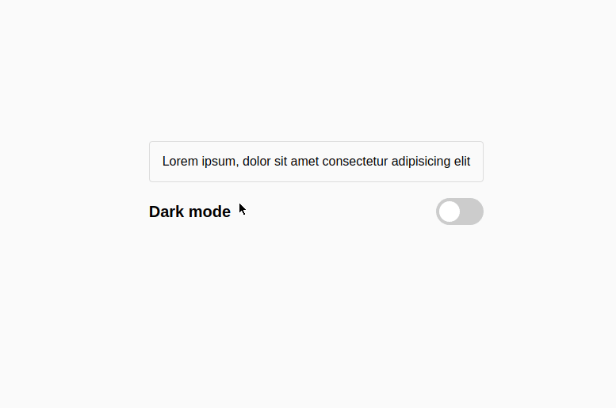

# react-theme-switcher

A React JS-based switch to change style of page from **Light** to **Dark** or vice versa.

[](https://basemax.github.io/react-theme-switcher/)

[Watch Demo](https://basemax.github.io/react-theme-switcher)

## Features

- CSS Animation
- React JS
- React Context
- React State Management
- Host ReactJS App via [GitHub Pages](https://pages.github.com/)

### Install dependency

```
npm install
```

### Start and serve service

```
npm start
```

### Build project

```
npm run-script build
```

Move build directory to gh-pages branch and commit:

```
cp build/ /tmp/
git checkout gh-pages
rm -rf *
mv /tmp/build/* .
git status
git add .
git commit -m "Upload build directory to gh-pages branch
git push
```

## Credit

This question was a company  question in a contest. I only join to solve this problem to challenge myself.

A good introduction for working with React Contexts:
- https://www.youtube.com/watch?v=35lXWvCuM8o
- https://www.youtube.com/watch?v=rFnfvhtrNbQ
- https://www.youtube.com/watch?v=5LrDIWkK_Bc
- https://www.youtube.com/watch?v=lhMKvyLRWo0

---------

# Max Base

My nickname is Max, Programming language developer, Full-stack programmer. I love computer scientists, researchers, and compilers. ([Max Base](https://maxbase.org/))

## Asrez Team

A team includes some programmer, developer, designer, researcher(s) especially Max Base.

[Asrez Team](https://www.asrez.com/)
